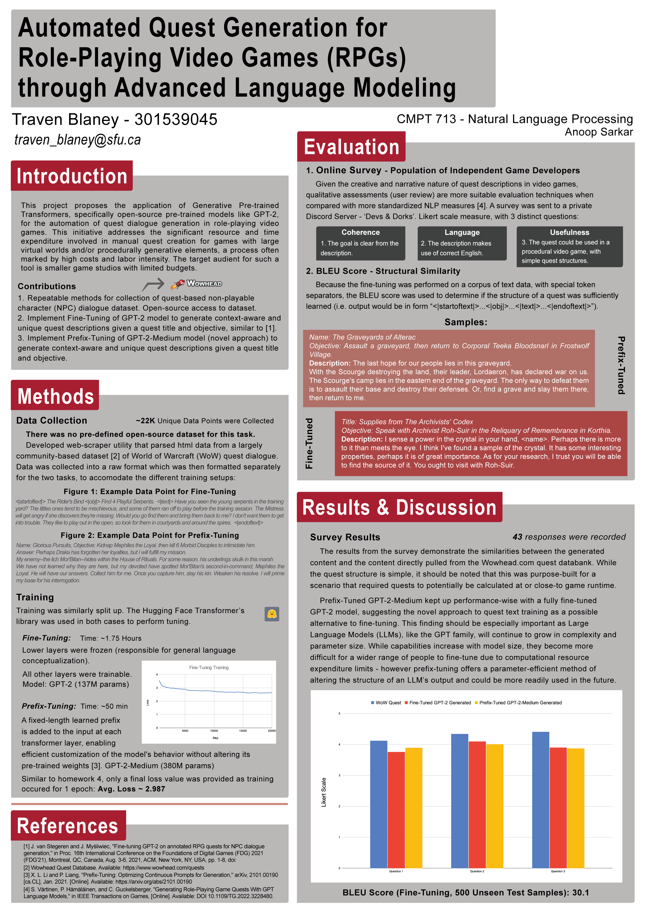

# Automated Quest Generation for RPGs

This repository contains the Jupyter Notebook and accompanying files for the project on automating quest dialogue generation in role-playing video games (RPGs) using Generative Pre-trained Transformers (GPT-2). The project was conducted as part of the coursework for CMPT 713.

## Introduction

The project explores the application of Large Language Models (LLMs), particularly open-source pre-trained models like GPT-2, to automate the creation of quest dialogues in RPGs. This approach aims to reduce the time and resources typically required for manual quest creation, thereby streamlining content development without compromising narrative quality.

## Motivation & Background

The video game industry is increasingly adopting procedurally generated and machine-learning-based content to enhance the dynamism and expansiveness of gaming experiences. However, dialogue and narrative development often still rely on traditional, labor-intensive methods. This project proposes the use of GPT-2 and GPT-2 Medium for generating immersive quest dialogues through both fine-tuning and prefix-tuning techniques.

## Project Goals

1. Develop repeatable methods for collecting NPC dialogue datasets and ensure open-source access.
2. Fine-tune the GPT-2 model to generate unique, context-aware quest descriptions based on quest titles and objectives.
3. Employ a novel prefix-tuning approach with the GPT-2 Medium model to achieve similar ends.

## Results Summary

The project successfully demonstrated that GPT-2 models could be fine-tuned and prefix-tuned to generate engaging and contextually relevant quest narratives. This approach shows promise for reducing the dependency on manual content creation in game development.

Example quests generated by a Prefix-tuned GP2 Medium model:

Quest #1: WoW Dataset Title: Smoke Over the Mountain
Objective: Find Pathfinder Yip's plane. Description: < Pathfinder Jeb looks at the mountain ridge beyond the camp and sniffs. > "I don't like it. Pathfinder Yips should've been here days ago. Was gonna help me teach this new batch of explorers how to climb these pillars safely. Now I see smoke in the distance. I don't like it at all."

Quest #2: Wow Dataset Title: Collecting Kelp Objective: Bring 4 Crystal Kelp Fronds to William Pestle in Goldshire. Description: I can make an invisibility liquor for Maybell, so she can slip away from the Maclure Vineyards and go to Tommy Joe. But to make the liquor, I need some crystal kelp. Although the kelp usually grows in the ocean. . . sometimes murlocs collect it. See if the murlocs near Crystal Lake have any. Crystal Lake is just east of Goldshire.

Quest #3: Fine-Tuned Model Generated Title: Lord Grayson Shadowbreaker Objective: Speak with Lord Grayson Shadowbreaker in Stormwind's Cathedral District.
Description: Grayson's most revered followers, including his eldest, Grayson Deathguard, are among those who would make him the next king of the Stormwind. Grayson's death is still felt long after the first wave of Stormwind's defeat. Travel to Stormwind and find the Archdruid of Thunder Bluff at the Cathedral of the Crimson Flame.

Quest #4: Fine-Tuned Model Generated Title: Supplies from The Archivists' Codex Objective: Speak with Archivist Roh-Suir in the Reliquary of Remembrance in Korthia.
Description: I sense a power in the crystal in your hand, . Perhaps there is more to it than meets the eye. I think I've found a sample of the crystal. It has some interesting properties, perhaps it is of great importance. As for your research, I trust you will be able to find the source of it. You ought to visit with Roh-Suir.

## Viewing the Full Report

The full details of the methodology, experiments, and results are available in the Jupyter Notebook. You can view this complete report at:
[CMPT 713 Project Notebook](answer/cmpt713_tcb5_proj.ipynb)

## Conclusion

This project underscores the potential of LLMs to significantly impact content creation in video games, offering a scalable alternative to traditional narrative development processes. The successful implementation of both fine-tuning and prefix-tuning methods suggests a viable path forward for integrating AI-driven content generation into mainstream game development.

